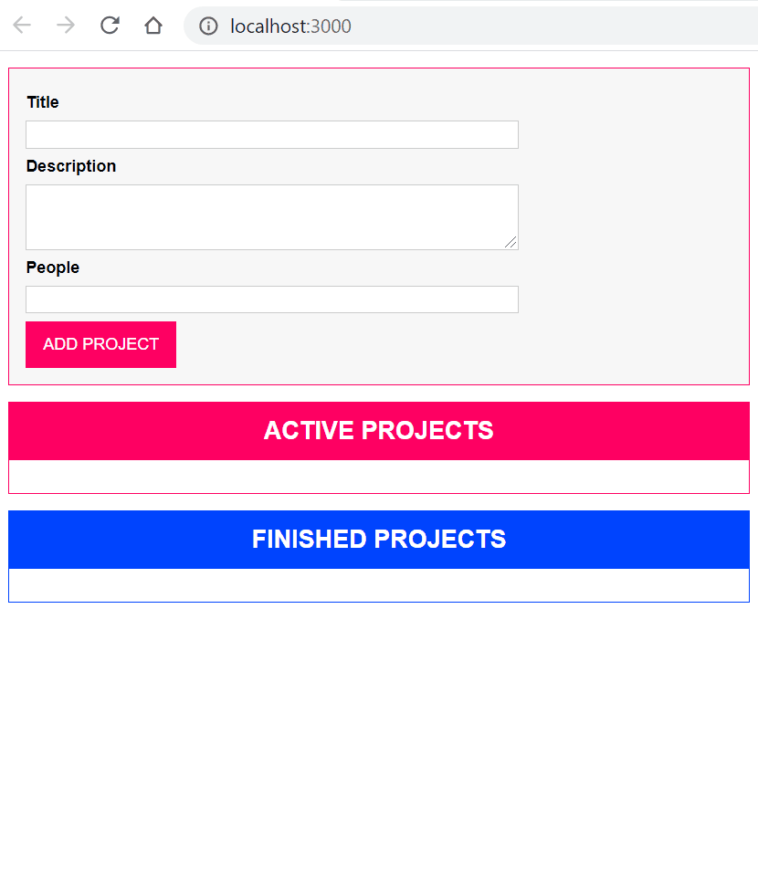

# Basics of TypeScript

This project contains the basic development setup and foundational concepts when working with TypeScript. A simple web app allowing users to add and manage active and finished projects. The app's front-end logic is written completely with TypeScript.

  

## 3rd-Party Packages

The project uses the following 3rd-party [Node.js](https://nodejs.org/) package

| Package | Type | Purpose |
|---------|------|---------|
| [lite-server](https://www.npmjs.com/package/lite-server) | `dev` | A lightweight development `Node.js` server that serves a web app, opens it in the browser, refreshes when html or javascript change, injects CSS changes and has a fallback page when a route is not found |

## Source Code

Switch the source code to versions described below to view different implementations.

| Git Tag | Implementation |
|---------|----------------|
| [v1.0.0](https://github.com/TranXuanHoang/TypeScript/releases/tag/v1.0.0) | Basic setup for a web app using TypeScript to write its front-end logic |
| [v1.1.0](https://github.com/TranXuanHoang/TypeScript/releases/tag/v1.1.0) | Write a dashboard web app all allowing us to create and manage projects |

## Run App

* Install `Node.js` dependencies with `npm install`
* To compile `TypeScript` `.ts` files into `JavaScript` automatically whenever new changes are added to any of `TypeScript` files, run `tsc -w` or `tsc --watch`
* Then, run `npm start` that will spin up a `lite-server` hosting all resources including `.html`, `.css` and the compiled `.js` files in the `dist` directory
