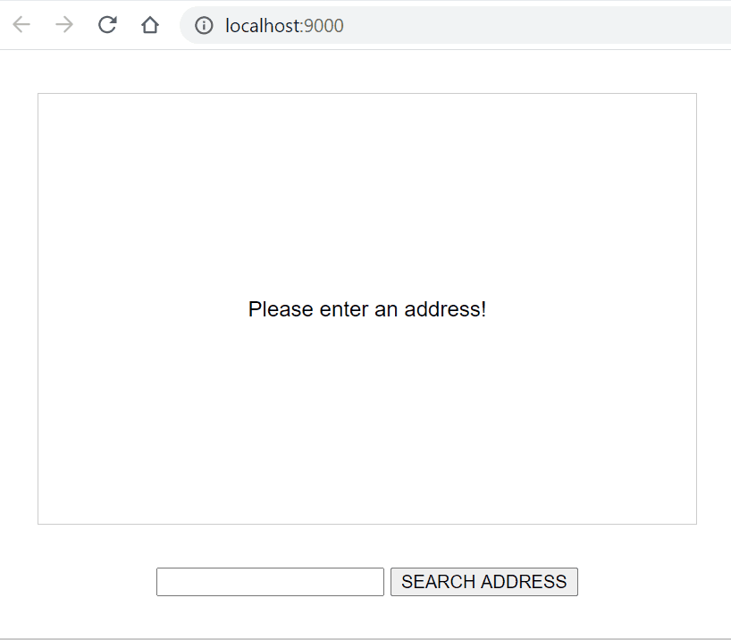

# Maps

Demonstrate how to use third-party libraries in combination with `TypeScript` through building a simple web app that uses `Google Maps` APIs (specifically [Geocoding API](https://developers.google.com/maps/documentation/geocoding/overview) and [Maps JavaScript API](https://developers.google.com/maps/documentation/javascript/overview)) to allow users enter an arbitrary address then shows a map with a marker of the location of that address.

<p align="center">
  
</p>

## 3rd-Party Packages

The project uses the following 3rd-party `npm` packages

| Package | Type | Purpose |
|---------|------|---------|
| [lite-server](https://www.npmjs.com/package/lite-server) | `dev` | A lightweight development `Node.js` server that serves a web app, opens it in the browser, refreshes when html or javascript change, injects CSS changes and has a fallback page when a route is not found |
| [webpack](https://www.npmjs.com/package/webpack) | `dev` | Bundles JavaScript files for usage in a browser. Packs CommonJs/AMD modules for the browser. Allows to split your codebase into multiple bundles, which can be loaded on demand. Support loaders to preprocess files, i.e. json, jsx, es7, css, less, ... |
| [webpack-cli](https://www.npmjs.com/package/webpack-cli) | `dev` | CLI for webpack |
| [webpack-dev-server](https://www.npmjs.com/package/webpack-dev-server) | `dev` | Serves a webpack app. Updates the browser on changes |
| [typescript](https://www.npmjs.com/package/typescript) | `dev` | A language for application scale JavaScript development |
| [ts-loader](https://www.npmjs.com/package/ts-loader) | `dev` | TypeScript loader for webpack |
| [clean-webpack-plugin](https://www.npmjs.com/package/clean-webpack-plugin) | `dev` | A webpack plugin to remove/clean build directory(ies) |
| [axios](https://www.npmjs.com/package/axios) | `production` | Promise based HTTP client for the browser and Node.js |
| [@types/googlemaps](https://www.npmjs.com/package/@types/googlemaps) | `dev` | Provides type definitions for Google Maps APIs |

## Source Code

Switch the source code to versions described below to view different implementations.

| Git Tag | Implementation |
|---------|----------------|
| [v2.0.0](https://github.com/TranXuanHoang/TypeScript/releases/tag/v2.0.0) | Basic setup for this app (including Webpack build configs) |
| [v2.0.1](https://github.com/TranXuanHoang/TypeScript/releases/tag/v2.0.1) | Add location searching with Google Maps APIs |

## Run App

* Install 3rd-parties `npm` dependencies with `npm install`
* Check that the `<script>` tag in the header of the [index.html](index.html) has `src` refering to `app.js` as follows

  ```html
  <script type="module" src="dist/bundle.js" defer><script>
  ```

* __Method 1:__ Compile code with `Webpack` and `TypeScript` `loader` and host the app with `Lite Server`

  * To compile `TypeScript` `.ts` files into `JavaScript` automatically whenever new changes are added to any of `TypeScript` files, run `npm run watch:dev` that will automatically re-build `TypeScript` code whenever new changes are made
  * Then, run `npm start:lite-server` that will spin up a `lite-server` hosting all resources including `.html`, `.css` and `dist/bundle.js`

* __Method 2:__ Compile, bundle code and host the app with `Webpack` and `Webpack Dev Server`

  * Run `npm run serve:dev` in a separate terminal/powershell to spin up a local `webpack-dev-server`. The `webpack-dev-server` will compile `TypeScript` code to `JavaScript` and bundle all `JavaScript` code into a single `bundle.js` file that _only exists in the memory_ - any new changes to `.ts` files will not be immediately compiled and added to the `dist/bundle.js` in the local hard disk but will be added to the one in the memory which in turn be lively reloaded on browsers.

## Compile for Production

* Run `npm run build:prod` to compile and bundle all `TypeScript` code into a single `dist/bundle.js` file that is ready for production
* Run `npm run watch:prod` to _automatically re-compile and re-bundle_ all `TypeScript` code into a single production-ready `dist/bundle.js` file whenever the `TypeScript` code is modified
